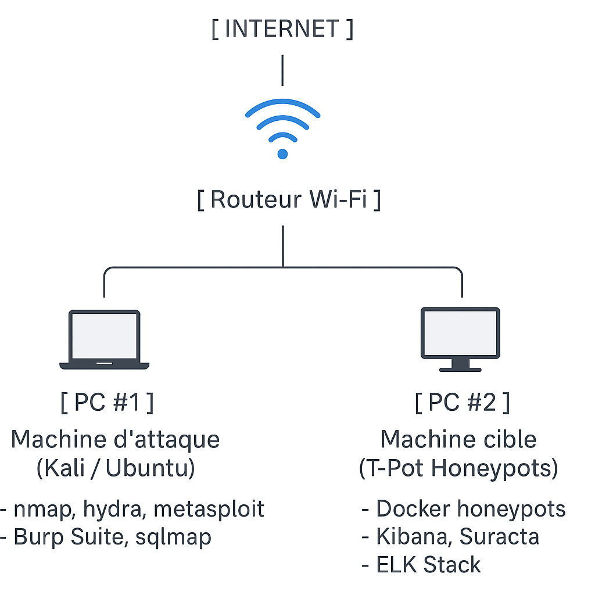
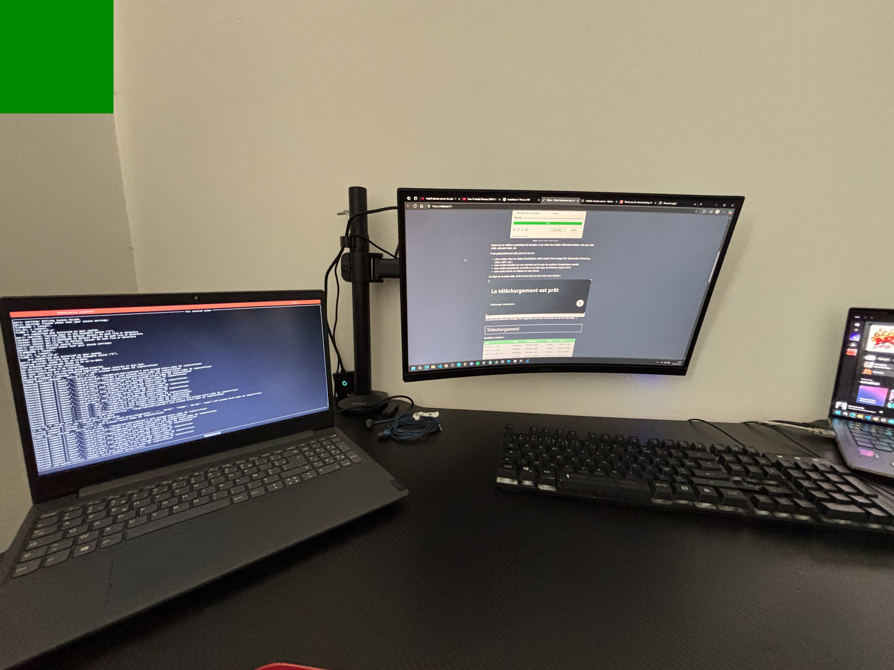

# 🔧 Mise en place d’un serveur Ubuntu sans fil (Wi-Fi)

> 🖥️ **Objectif** : Connecter un serveur Ubuntu (22.04+, `noble`) à un réseau Wi-Fi **sans accès initial à Internet**, configurer **SSH** pour le contrôler à distance, et **automatiser la reconnexion au démarrage**.


---

## 📜 Sommaire

- [Présentation du projet](#présentation-du-projet)
- [Plan réseau de mon Homelab](#Plan-réseau-de-mon-Homelab)
- [Pré-requis](#pré-requis)
- [Étapes détaillées](#étapes-détaillées)
  - [1. Préparation réseau minimale](#1-préparation-réseau-minimale)
  - [2. Connexion Wi-Fi manuelle](#2-connexion-wi-fi-manuelle)
  - [3. SSH (connexion distante)](#3-ssh-connexion-distante)
- [Commandes utiles](#commandes-utiles)
- [Fiabilisation](#fiabilisation)
- [Annexes : IP statique avec Netplan](#annexes--ip-statique-avec-netplan)
- [Crédits & Contexte](#crédits--contexte)
- [Illustrations](#illustrations)

---

## Présentation du projet

Ce projet documente la configuration d’un **serveur Ubuntu sans interface graphique** qui doit se connecter en Wi-Fi **sans accès Internet initial**, pour ensuite être contrôlé à distance via **SSH**.

---

## Plan réseau de mon Homelab


---

## Pré-requis

- Ubuntu Server 24.04 (noble) ou supérieur
- Une **clé USB** pour transférer des fichiers `.deb`
- Un **dongle Wi-Fi** compatible avec `iwconfig` / `wpa_supplicant`
- Un second PC (pour transfert, SSH)
- Connexion Internet sur ce second PC (pour télécharger les paquets)

---

## Étapes détaillées

### 1. Préparation réseau minimale

Ubuntu Server ne contient pas les outils Wi-Fi par défaut. On commence par les installer via clé USB :

#### ➤ Installer `wireless-tools` :

Sur un autre PC connecté à Internet (Linux ou Windows) :
https://packages.ubuntu.com

Recherchez wireless-tools pour Ubuntu 24.04 "noble".

Téléchargez le fichier .deb depuis un des miroirs proposés.

Transfèrez-le sur votre serveur Ubuntu via clé USB.

Branchez la clé USB sur le serveur, puis monte-la si nécessaire :

```bash
sudo mkdir /mnt/usb
sudo mount /dev/sdX1 /mnt/usb  # remplace sdX1 par le nom réel de ta clé (ex: sdb1)
```

Installez le paquet .deb :

```bash
sudo dpkg -i /mnt/usb/wireless-tools_*.deb
```
➤ Résolution d’erreurs fréquentes :
```bash
Erreur : usb2-2: device descriptor read/8, error -110
```
signale un problème de communication USB, souvent lié à :

- un port USB défectueux
- une clé USB mal insérée ou incompatible
- un manque d'alimentation pour le périphérique
- ou une erreur dans le contrôleur USB du noyau
```bash
unable to enumerate USB device
```
Changez de port USB ou changez de clé USB.
```bash
cannot access archive: No such file or directory
```
Activer manuellement :
```bash
lsblk
sudo mkdir /mnt/usb
sudo mount /dev/sdX1 /mnt/usb   # Remplacez sdX1 par la bonne lettre de votre clé, ex: sdb1
```

Pour vérifier que le fichier est bien la 
```bash
ls /mnt/usb
```

Vous devriez voir:
```bash
wireless-tools_30~pre9-13.1ubuntu3_amd64.deb
```

Si le fichier est bien visible, installe-le avec :

```bash
sudo dpkg -i /mnt/usb/wireless-tools_30~pre9-13.1ubuntu3_amd64.deb
```
Ensuite nous avons besoin de libiw30_30, on suit le meme processus :

```bash
libiw30_30~pre9-13.1ubuntu3_amd64.deb
```
```bash
sudo dpkg -i /mnt/usb/wireless-tools_30~pre9-13.1ubuntu3_amd64.deb
```

Puis répéter cette opération pour tous packets qui doit etre installées.

```bash
sudo dpkg -i /mnt/usb/wpasupplicant_2.10-15_amd64.deb
sudo dpkg -i /mnt/usb/rfkill_2.39.3-9ubuntu6_amd64.deb
sudo dpkg -i /mnt/usb/isc-dhcp-client_4.4.3-P1-4ubuntu2_amd64.deb
sudo dpkg -i /mnt/usb/isc-dhcp-common_4.4.3-P1-4ubuntu2_amd64.deb
```

### 2. Connexion Wi-Fi manuelle
Créer le fichier de configuration :

```bash
sudo nano /etc/wpa_supplicant.conf
Contenu :

ctrl_interface=DIR=/run/wpa_supplicant GROUP=netdev
network={
  ssid="NomDuReseauWiFi"
  psk="MotDePasseWiFi"
}
```
Connexion manuelle :

```bash
sudo ip link set wlan0 up
sudo wpa_supplicant -B -i wlan0 -c /etc/wpa_supplicant.conf
sudo dhclient wlan0
```
Vérification :
```bash
ping google.com
```
Si vous parvenez a reach google.com vous etes connecté.

**Maintenant pour connaitre l'adresse Ip de votre Ubuntu Server**
```bash
ip a
```

### 3. SSH (connexion distante)

Installation :

```bash
sudo apt install openssh-server
sudo systemctl enable ssh
sudo systemctl start ssh
```
Vérifier le statut :

```bash

sudo systemctl status ssh
```
Connexion depuis un autre PC :

```bash

ssh nom_utilisateur@ip_du_serveur
```

## Commandes utiles

| Action                      | Commande                    | Description                                      |
|-----------------------------|-----------------------------|--------------------------------------------------|
| Redémarrer le système       | sudo reboot                 | Redémarre immédiatement le système               |
| Éteindre le système         | sudo poweroff               | Éteint complètement l'ordinateur                 |
| Mettre en veille (suspend)  | systemctl suspend           | Mode veille (RAM active)                         |
| Hiberner le système         | systemctl hibernate         | Hibernation (sauvegarde de la RAM)               |
| Vérifier l'état du Wi-Fi    | iwconfig wlan0              | Affiche l’état de l’interface Wi-Fi              |
| Afficher l'adresse IP       | ip a show wlan0             | Affiche l’adresse IP de l’interface wlan0        |
| Trafic réseau en temps réel | sudo iftop -i wlan0         | Surveille le trafic réseau en direct             |

J'ai aussi écrit un petit script bash pour se connecter au wifi manuellement, au lieu de reecrire toutes les commandes à la main.


**Pour le lancer**

```bash
chmod +x WIFI-Manuel.sh
./WIFI-Manuel.sh
```


## Fiabilisation
```bash
Activer SSH au démarrage :

sudo systemctl enable ssh
```
Configurer le pare-feu :
```bash
sudo ufw allow ssh
sudo ufw enable
```
Éviter les changements d’IP :

Réserver une IP statique dans la box/routeur

Ou configurer une IP fixe via Netplan (voir section suivante)

## Annexes : IP statique avec Netplan
Modifier ou créer un fichier Netplan :

```yaml
network:
  version: 2
  renderer: networkd
  wifis:
    wlan0:
      dhcp4: no
      addresses: [192.168.1.42/24]
      gateway4: 192.168.1.1
      nameservers:
        addresses: [8.8.8.8, 1.1.1.1]
      access-points:
        "NomDuReseauWiFi":
          password: "MotDePasseWiFi"
          ```
Appliquer la configuration :

```bash
sudo netplan apply
```
## Crédits & Contexte

Ce guide est la documentation de mon déploiement de Ubuntu Server pour mon Homelab où :

Le serveur n’avait pas d’accès Internet

L'installation s'est faite via clé USB et .deb

Problèmes rencontrés :
- pas de connextion Wifi 
- pas de paquets déja installés

Résultat : connexion stable, accès SSH, reconnexion automatique

## illustrations




